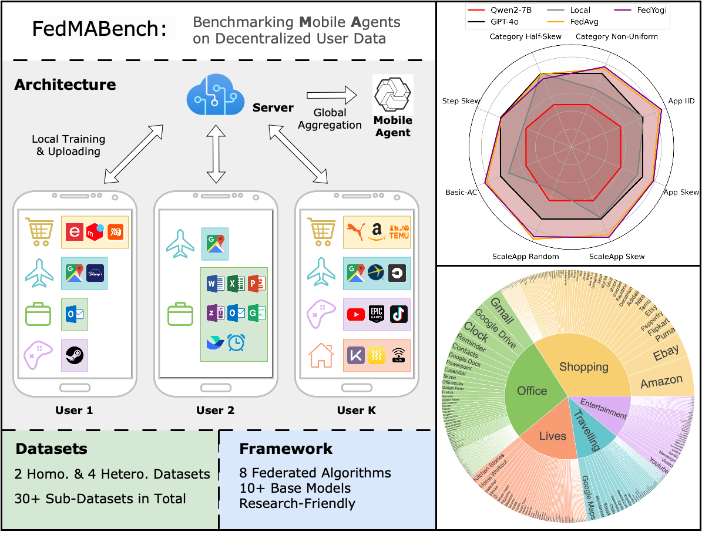

# FedMABench: Benchmarking Mobile Agents on Decentralized Heterogeneous User Data

## 🎉 News 
We are happy to share that FedMABench is accepted to EMNLP 2025 main conference, oral !

## 📝 Introduction
**FedMABench** is an open-source benchmark for federated training and evaluation of *mobile agents*, specifically designed for heterogeneous scenarios. 


FedMABench includes the following key features:
- 6 **datasets** with 30+ subsets （over 800 apps across 5 categories）
- 3 types of **heterogeneity** (e.g., *App Category Distribution*, *Specific App Preference*, etc.)
- 8 **federated learning** algorithms (e.g., *FedAvg*, *FedProx*, *SCAFFOLD*, *FedAvgM*, etc.).
- 10+ **base models** covering *Qwen2-VL-2B/7B-Instruct*, *InternVL2-1B/2B/4B/8B*, *DeepseekVL2* and more.




This benchmark is based upon [ms-swift](https://github.com/modelscope/ms-swift/).
We thank the authors for their valuable contributions!

## 📱 Datasets
The datasets of FedMABench are public available at HuggingFace: [wwh0411/FedMABench](https://huggingface.co/datasets/wwh0411/FedMABench).
For downloading the image files, due to the large file size, its very inconvenient to upload the full unpacked images.
For reproducibility, we update our code for unpacking from the original image source 

Due to the large size of the image data, we do not directly provide the unpacked image files. Instead, for reproducibility, our code supports unpacking the images from their original sources — AndroidControl and AitW.

1. Download the TFRecord files from the corresponding Google Drive links: [AndroidControl](https://console.cloud.google.com/storage/browser/gresearch/android_control) and [AitW](https://console.cloud.google.com/storage/browser/gresearch/android-in-the-wild).
2. Modify the file path in the Python script under the directory `data_process/`.
3. Run the following command:
```
python data_process/1_dump_ac.py
python data_process/2_gen_jsonl_from_unpack_ac.py
```

## 🛠️ Installation


Clone the repo, submodules and install the required packages through source code.
Please ensure your Python version is higher than 3.8, recommend torch>=2.0.0.
```
conda create -n fedma python=3.10
conda activate fedma
git clone --recursive --shallow-submodules https://github.com/wwh0411/FedMABench.git
cd FedMABench
pip install -e '.[llm]'
```

## 🚀 Getting Started

### Training

We provide training scripts under `bash/`. Try them out from the top-level directory of this repository.

The training script is in `bash/run_fed_qwen2.sh`.

```
CUDA_VISIBLE_DEVICES=$2 MAX_PIXELS=602112 \
  swift sft \
  --round 30 \
  --round_per_epoch 10 \
  --fed_alg fedavg \
  --client_num 10 \
  --model_type qwen2-vl-7b-instruct \
  --model_id_or_path /hub/qwen/Qwen2-VL-7B-Instruct \
  --check_model_is_latest False \
  --lazy_tokenize True \
  --preprocess_num_proc 4 \
  --dataset $2 \
  --sft_type lora \
  --tuner_backend peft \
  --dtype AUTO \
  --output_dir output \
  --train_dataset_sample -1 \
  --dataset_test_ratio 0 \
  --max_steps -1 \
  --max_length 4096 \
  --check_dataset_strategy warning \
  --lora_rank 8 \
  --lora_alpha 32 \
  --lora_dropout 0.05 \
  --gradient_checkpointing true \
  --batch_size 1 \
  --weight_decay 0.1 \
  --learning_rate 5e-5 \
  --gradient_accumulation_steps 4 \
  --max_grad_norm 0.5 \
  --warmup_ratio 0.03 \
  --eval_strategy no \
  --save_strategy no \
  --logging_steps 100
```

Key arguments:

- `model_type`: Type of the base model
- `model_id_or_path`: Local path of the base model
- `dataset`: Local path of the dataset. 
- `fed_alg`: Name of the federated learning algorithm
- `client_num`: Total number of clients
- `round`: Number of training rounds
- `sft_type`: Fine-tuning type (e.g., lora)
- `lora_rank`/`lora_alpha`/`lora_dropout`: LoRA-related parameters
- `batch_size`: Training batch size
- `learning_rate`: Learning rate
- `gradient_accumulation_steps`: Number of steps for gradient accumulation

### Evaluation

We provide training scripts under `evaluation/`. Try them out from the top-level directory of this repository.

The training script is in `evaluation/test_app.sh`.

```
#!/bin/bash

base_path=./bash/output
model=qwen2-vl-7b-instruct
model_id_or_path=Qwen2-VL-7B-Instruct
round_list=10  #
val_dataset=Val_100.jsonl
peft_list=(
)

for round in ${round_list[@]}; do  # 
    for i in ${peft_list[@]}; do
        echo "Testing round $round with $i"
        jsonl_files=$(find "$base_path/$model/$i/global_lora_$round/infer_result" -type f -name "*.jsonl")

        if [ -z "$jsonl_files" ]; then
            MAX_PIXELS=602112 CUDA_VISIBLE_DEVICES=$1 swift infer --ckpt_dir "$base_path/$model/$i/global_lora_$round" \
              --val_dataset $val_dataset --model_type $model --model_id_or_path $model_id_or_path --sft_type lora
        fi

        # calculate acc
        jsonl_files=$(find "$base_path/$model/$i/global_lora_$round/infer_result" -type f -name "*.jsonl")
        for jsonl_file in $jsonl_files; do
            # Process each jsonl file here
            echo $jsonl_file
            #    cd evaluation
            output_file="$base_path/$model/$i/global_lora_$round/infer_result/$(basename $jsonl_file .jsonl)_result.txt"
            python test_swift_fed.py --data_path "$jsonl_file" > "$output_file"
        done
    done
done
```

Key arguments:
- `peft_list`: List of the trained models
- `round_list`: List of the rounds for evaluation
- `val_dataset`: Local path of the dataset for evaluation
- `model`: Name of the base model
- `model_id_or_path`: Local path of the base model


### Supported Models

| Model Type                                                | Model Introduction                                                                     | Language           | Model Size                            | Model Type               |
|-----------------------------------------------------------|----------------------------------------------------------------------------------------|--------------------|---------------------------------------|--------------------------|
| Qwen-VL<br>Qwen2-VL                      | [Tongyi Qwen vision model](https://github.com/QwenLM)                                  | Chinese<br>English | 2B-72B<br>including quantized versions    | base model<br>chat model |
| YI-VL                                                      | [01AI's YI series vision models](https://github.com/01-ai)                             | Chinese<br>English | 6B-34B                                | chat model               |
| InternVL<br>Mini-InternVL<br>InternVL2                    | [InternVL](https://github.com/OpenGVLab/InternVL)                                      | Chinese<br>English | 1B-40B<br>including quantized version | chat model               |


### Supported Hardware

| Hardware Environment           | Notes                                           |
|--------------------------------|-------------------------------------------------|
| CPU                            |                                                 |
| RTX 20/30/40 series, etc.      | After 30 series, BF16 and FlashAttn can be used |
| Computing cards T4/V100, etc.  | BF16 and FlashAttn not supported                |
| Computing cards A10/A100, etc. | Support BF16 and FlashAttn                      |
| Huawei Ascend NPU              |                                                 |

### Environment variables

- DATASET_ENABLE_CACHE: Enable cache when preprocess dataset, you can use `1/True` or `0/False`, default `False`
- WEBUI_SHARE: Share your web-ui, you can use `1/True` or `0/False`, default `False`
- SWIFT_UI_LANG: web-ui language, you can use `en` or `zh`, default `zh`
- WEBUI_SERVER: web-ui host ip，`0.0.0.0` for all routes，`127.0.0.1` for local network only. Default `127.0.0.1`
- WEBUI_PORT: web-ui port
- USE_HF: Use huggingface endpoint or ModelScope endpoint to download models and datasets. you can use `1/True` or `0/False`, default `False`
- FORCE_REDOWNLOAD: Force to re-download the dataset

Other variables like `CUDA_VISIBLE_DEVICES` are also supported, which are not listed here.


## 📎 Citation

```bibtex
@misc{wang2025fedmabenchbenchmarkingmobileagents,
      title={FedMABench: Benchmarking Mobile Agents on Decentralized Heterogeneous User Data}, 
      author={Wenhao Wang and Zijie Yu and Rui Ye and Jianqing Zhang and Siheng Chen and Yanfeng Wang},
      year={2025},
      eprint={2503.05143},
      archivePrefix={arXiv},
      primaryClass={cs.AI},
      url={https://arxiv.org/abs/2503.05143}, 
}
```

